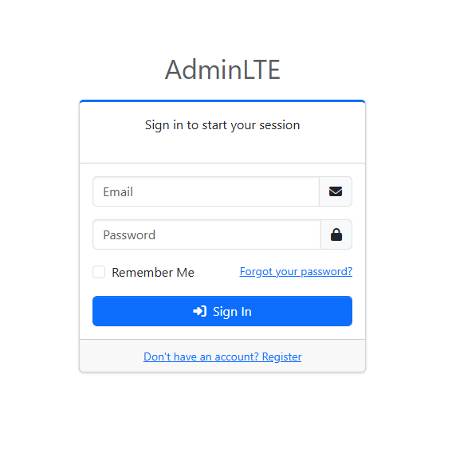
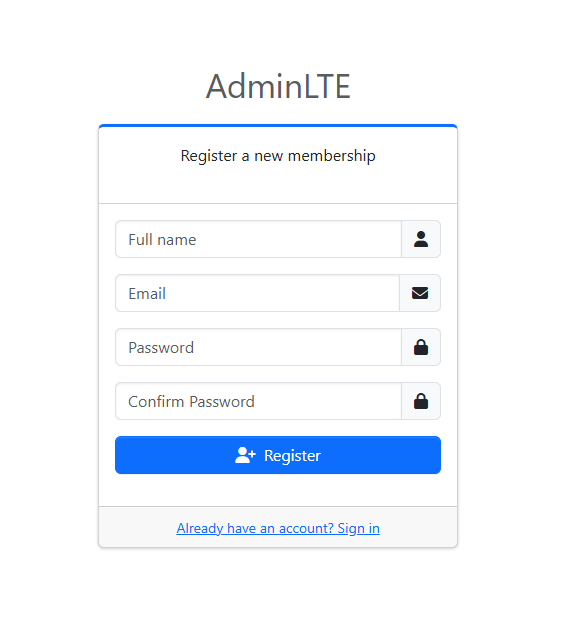
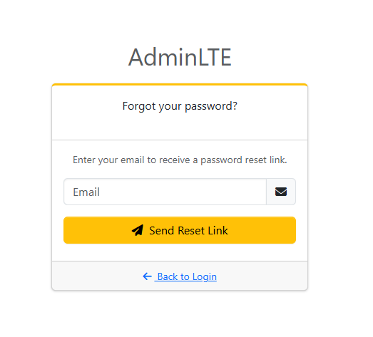

# Laravel AdminLTE Auth

[](https://packagist.org/packages/chamikasamaraweera/laravel-adminlte-auth)
[](LICENSE)
[](https://php.net)
[](https://laravel.com)
<!--  -->


**AdminLTE Bootstrap 5 Auth UI scaffolding for Laravel.**

Scaffold beautiful, production-ready authentication views powered by [AdminLTE 4](https://adminlte.io) and [Bootstrap 5](https://getbootstrap.com) with a single Artisan command — just like `php artisan ui bootstrap --auth`.

---

## Features

- One-command auth view scaffolding
- AdminLTE 4 + Bootstrap 5 styled views
- Login, Register, Forgot Password, Reset Password, Email Verification
- Font Awesome 6 icons
- `@error` validation support on all fields
- Overwrite-protection with confirmation prompt
- Compatible with Laravel 11, 12, and 13

---

## Requirements

| Dependency | Version |
|---|---|
| PHP | ^8.2 |
| Laravel | ^11.0 \| ^12.0 \| ^13.0 |
| laravel/ui | ^4.x |

---

## Installation

**Step 1 — Install the package via Composer:**

```bash
composer require chamikasamaraweera/laravel-adminlte-auth
```

**Step 2 — Install `laravel/ui` (if not already installed):**

```bash
composer require laravel/ui
php artisan ui:auth
```

> `php artisan ui:auth` generates the auth controllers and routes. This package replaces the views only.

**Step 3 — Scaffold the AdminLTE auth views:**

```bash
php artisan ui:adminlte --auth
```

**Step 4 — Make sure your auth routes include verification support:**

```php
// routes/web.php
Auth::routes(['verify' => true]);
```

---

## Published Views

Running `php artisan ui:adminlte --auth` publishes the following files into `resources/views/`:

```
resources/views/
├── layouts/
│   └── auth.blade.php          ← AdminLTE + BS5 base layout
└── auth/
    ├── login.blade.php
    ├── register.blade.php
    ├── verify.blade.php
    └── passwords/
        ├── email.blade.php
        └── reset.blade.php
```

---

## Artisan Commands

### `php artisan ui:adminlte --auth`

Publishes all auth views and the base layout.

### `php artisan ui:adminlte --views`

Publishes views only (same as `--auth` currently — useful for re-publishing after updates).

> If a view file already exists, the command will ask for confirmation before overwriting it.

---

## Assets

The published layout (`layouts/auth.blade.php`) loads all assets from CDN — no npm install required:

| Asset | Version | Source |
|---|---|---|
| Bootstrap | 5.3.3 | jsDelivr CDN |
| AdminLTE | 4.0.0-beta3 | jsDelivr CDN |
| Font Awesome | 6.5.0 | cdnjs CDN |
| Source Sans Pro | — | Google Fonts |

To use local assets instead, edit `resources/views/layouts/auth.blade.php` after publishing and replace the CDN links with your Vite/Mix compiled assets.

---

## Customization

All views are published into your application's `resources/views/` directory, so you own them completely. Edit any file as needed — changes will not be overwritten unless you re-run the command and confirm the overwrite prompt.

### Changing the card accent color

Each view uses an AdminLTE card outline class:

| View | Card class |
|---|---|
| Login | `card-outline card-primary` |
| Register | `card-outline card-primary` |
| Forgot Password | `card-outline card-warning` |
| Reset Password | `card-outline card-primary` |
| Email Verify | `card-outline card-success` |

Change `card-primary` to any Bootstrap color (`card-danger`, `card-dark`, etc.).

### Adding a logo image

In `layouts/auth.blade.php` or any individual view, replace the text logo:

```blade
{{-- Before --}}
<a href="{{ url('/') }}"><b>{{ config('app.name') }}</b></a>

{{-- After --}}
<a href="{{ url('/') }}">
    
</a>
```

---

## Screenshot

> _Login, Register, and Forgot Password views styled with AdminLTE 4 card-outline design._

### Login


### Register


### Reset Password


---

## Changelog

See [CHANGELOG.md](CHANGELOG.md) for a full history of changes.

---

## Contributing

Contributions are welcome! Please read [CONTRIBUTING.md](CONTRIBUTING.md) before submitting a pull request.

---

## Security

If you discover a security vulnerability, please follow the process outlined in [SECURITY.md](SECURITY.md). **Do not open a public issue.**

---

## License

The MIT License (MIT). See [LICENSE](LICENSE) for details.

---

## Credits

- [Chamika Samaraweera](https://github.com/ChamikaSamaraweera)
- [AdminLTE](https://adminlte.io) by ColorlibHQ
- [Bootstrap](https://getbootstrap.com)
- All [contributors](https://github.com/ChamikaSamaraweera/laravel-adminlte-auth/graphs/contributors)